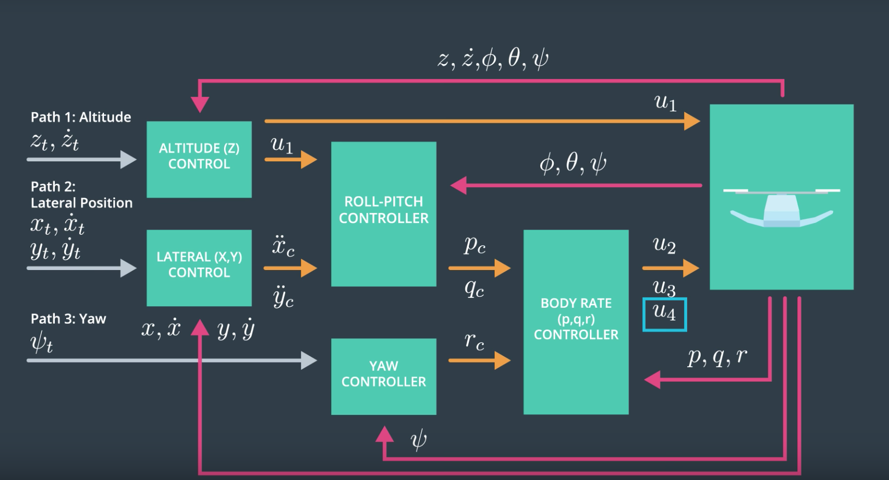

# Autonomous Flight Nanodegree
## Building a Controller: The Write up



### **Rubric 1**: Implemented body rate control in C++. 

- [x] The controller should be a proportional controller on body rates to commanded moments. 
- [x] The controller should take into account the moments of inertia of the drone when calculating the commanded moments.

The implementation of the body rate controller is as follows:

```CPP
    V3F momentCmd

    V3F error = pqrCmd - pqr;
    V3F ubar = kpPQR * error;
    momentCmd = ubar * V3F(Ixx, Iyy, Izz);
```

The controller takes into account the moments of inertia, Ix, Iy and Iz.

### **Rubric 2**: Implement roll pitch control in C++.

- [x] The controller should use the acceleration and thrust commands, in addition to the vehicle attitude to output a body rate command. 
- [x] The controller should account for the non-linear transformation from local accelerations to body rates. 
- [x] Note that the drone's mass should be accounted for when calculating the target angles.

The implementation for the roll-pitch controller is as follows:

```CPP
    V3F pqrCmd;
    Mat3x3F R = attitude.RotationMatrix_IwrtB();
    
    float b_x_a = R(0, 2);
    float b_y_a = R(1, 2);
    float R33 = R(2, 2);
    float R21 = R(1, 0);
    float R22 = R(1, 1);
    float R12 = R(0, 1);
    float R11 = R(0, 0);
    
    float b_x_c_target = CONSTRAIN(accelCmd[0] * mass / (collThrustCmd), -maxTiltAngle, maxTiltAngle);
    float b_y_c_target = CONSTRAIN(accelCmd[1] * mass / (collThrustCmd), -maxTiltAngle, maxTiltAngle);
    
    if (collThrustCmd < 0) {
        b_x_c_target = 0;
        b_y_c_target = 0;
    }
    
    float b_dot_x_c = kpBank * (b_x_c_target - b_x_a);
    float b_dot_y_c = kpBank * (b_y_c_target - b_y_a);
    
    float p_c = (1 / R33) * (R21 * b_dot_x_c - R11 * b_dot_y_c);
    float q_c = (1 / R33) * (R22 * b_dot_x_c - R12 * b_dot_y_c);
    
    pqrCmd.x = p_c;
    pqrCmd.y = q_c;

    return pqrCmd;
```

The controller takes a thrust command, x and y accelerations and the attitude of the drone (φ,ψ,θ) and outputs the p and q commands. `p_c`, `q_c`.  As you can see from the implementation the mass of the drone is accounted for when calculating the target angles.

In addition, the controller accounts for the non-linear transformation from local accelerations to body rates. This is represented by the first two expressions where the mass of the drone is accounted.:

```CPP
    float b_x_c_target = CONSTRAIN(accelCmd[0] * mass / (collThrustCmd), -maxTiltAngle, maxTiltAngle);
    float b_y_c_target = CONSTRAIN(accelCmd[1] * mass / (collThrustCmd), -maxTiltAngle, maxTiltAngle);
```

### **Rubric 3**: Implement altitude controller in C++.

- [x] The controller should use both the down position and the down velocity to command thrust. 
- [x] Ensure that the output value is indeed thrust (the drone's mass needs to be accounted for) and that the thrust includes the non-linear effects from non-zero roll/pitch angles. 
- [x] Additionally, the altitude controller should contain an integrator to handle the weight non-idealities presented in scenario 4.

The implementation of the altitude controller is as follows:

```CPP
    Mat3x3F R = attitude.RotationMatrix_IwrtB();

    float thrust = 0;
    float b_z = R(2, 2);
    float d_term = 0;

    velZCmd = -CONSTRAIN(-velZCmd, -maxDescentRate, maxAscentRate);
    float e = posZCmd - posZ;
    integratedAltitudeError += KiPosZ * e * dt;

    float u_bar_1 = kpPosZ * (posZCmd - posZ) + kpVelZ * (velZCmd - velZ) + accelZCmd + integratedAltitudeError + d_term;
    float accelZ = (u_bar_1 - 9.81f) / b_z;
    if (accelZ > 0) {
        accelZ = 0;
    }

    thrust = -accelZ * mass;

    return thrust;
```

The altitude controller ensures that the vehicle stays close to the commanded state by computing a thrust value; the output thrust is sent to the roll pitch controller.

### **Rubric 4**: Implement lateral position control in C++.

- [x] The controller should use the local NE position and velocity to generate a commanded local acceleration.

The lateral position controller is a PD controller for the x and y trajectories. It is responsible for generating an acceleration command which is then sent to the roll pitch controller.

The implementation of the lateral position controller is as follows:

```CPP
    accelCmdFF.z = 0;
    velCmd.z = 0;
    posCmd.z = pos.z;

    V3F desAccel;

    accelCmdFF[0] = CONSTRAIN(accelCmdFF[0], -maxAccelXY, maxAccelXY);
    accelCmdFF[1] = CONSTRAIN(accelCmdFF[1], -maxAccelXY, maxAccelXY);

    velCmd[0] = CONSTRAIN(velCmd[0], -maxSpeedXY, maxSpeedXY);
    velCmd[1] = CONSTRAIN(velCmd[1], -maxSpeedXY, maxSpeedXY);


    desAccel.x = kpPosXY * (posCmd[0] - pos[0]) + kpVelXY * (velCmd[0] - vel[0]) + accelCmdFF[0];
    desAccel.y = kpPosXY * (posCmd[1] - pos[1]) + kpVelXY * (velCmd[1] - vel[1]) + accelCmdFF[1];

    desAccel.x = -desAccel.x;
    desAccel.y = -desAccel.y;
    desAccel.x = CONSTRAIN(desAccel.x, -maxAccelXY, maxAccelXY);
    desAccel.y = CONSTRAIN(desAccel.y, -maxAccelXY, maxAccelXY);

    desAccel.z = 0;

    return desAccel;
```

### **Rubric 5**: Implement yaw control in C++.

- [x] The controller can be a linear/proportional heading controller to yaw rate commands (non-linear transformation not required).

Yaw control is control through the reactive moment command and that command only effects yaw. I used a linear transformation:

```CPP
    float yawRateCmd = 0;

    float yaw_error = yawRateCmd - yaw;
    yaw_error = fmodf(yaw_error, F_PI * 2.f);

    if (yaw_error > F_PI) {
        yaw_error = yaw_error - 2.0f * F_PI;
    } else if (yaw_error < -M_PI) {
        yaw_error = yaw_error + 2.0f * F_PI;
    }
    yawRateCmd = kpYaw * yaw_error;

    return yawRateCmd;
```

### **Rubric 6**: Implement calculating the motor commands given commanded thrust and moments in C++.

- [x] The thrust and moments should be converted to the appropriate 4 different desired thrust forces for the moments. 
- [x] Ensure that the dimensions of the drone are properly accounted for when calculating thrust from moments.

The code for calculating motor commands is shown below:
 
```CPP
    float a = momentCmd.x / (L * (1.414213562373095 / 2));
    float b = momentCmd.y / (L * (1.414213562373095 / 2));
    float c = momentCmd.z / kappa;
    float d = collThrustCmd;

    cmd.desiredThrustsN[0] = ((a + b + c + d) / (4.f));
    cmd.desiredThrustsN[1] = ((-a + b - c + d) / (4.f));
    cmd.desiredThrustsN[3] = ((-a - b + c + d) / (4.f));
    cmd.desiredThrustsN[2] = ((a - b - c + d) / (4.f));

    cmd.desiredThrustsN[0] = CONSTRAIN(cmd.desiredThrustsN[0], minMotorThrust, maxMotorThrust);
    cmd.desiredThrustsN[1] = CONSTRAIN(cmd.desiredThrustsN[1], minMotorThrust, maxMotorThrust);
    cmd.desiredThrustsN[2] = CONSTRAIN(cmd.desiredThrustsN[2], minMotorThrust, maxMotorThrust);
    cmd.desiredThrustsN[3] = CONSTRAIN(cmd.desiredThrustsN[3], minMotorThrust, maxMotorThrust);

    return cmd;
```

The dimensions of the drone have been accounted for to ensure that the commanded thrust is converted to a desired thrust for each motor.

### **Rubric 7**: Flight Evaluation

- [x] Your C++ controller is successfully able to fly the provided test trajectory and visually passes inspection of the scenarios leading up to the test trajectory.
